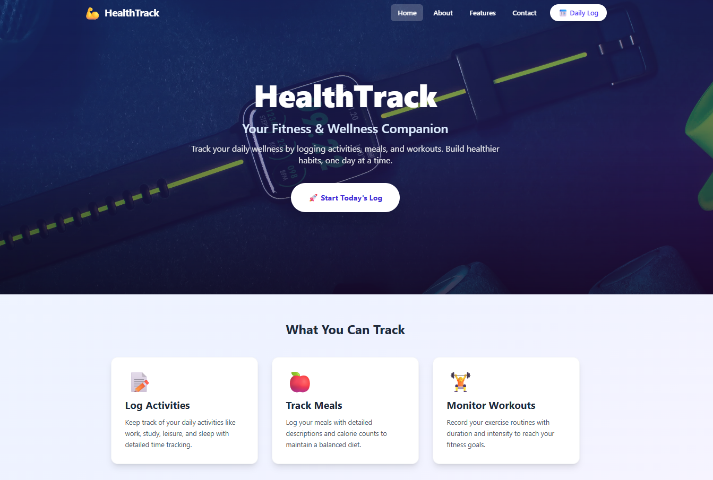
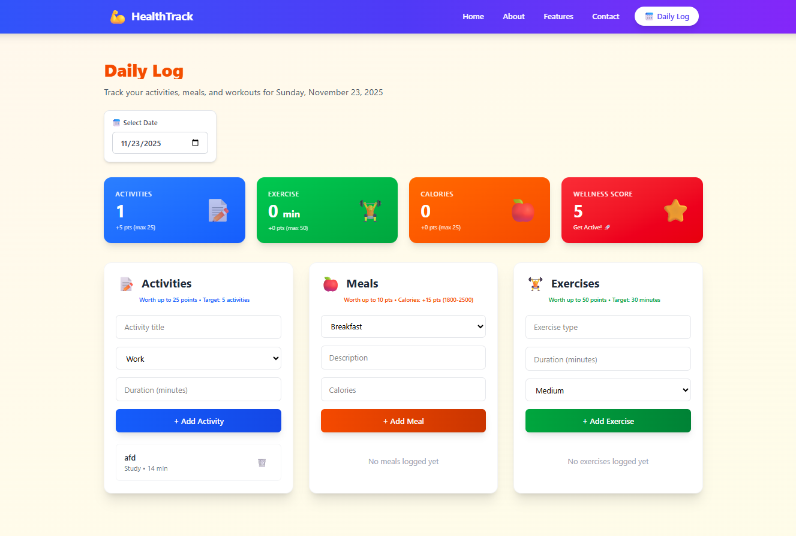
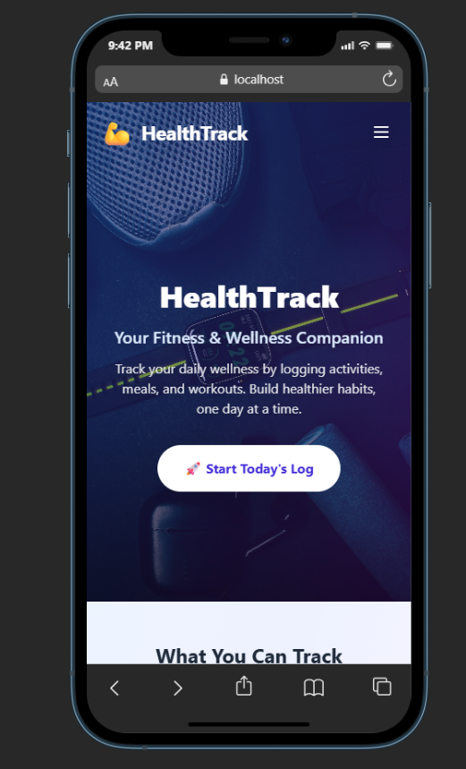
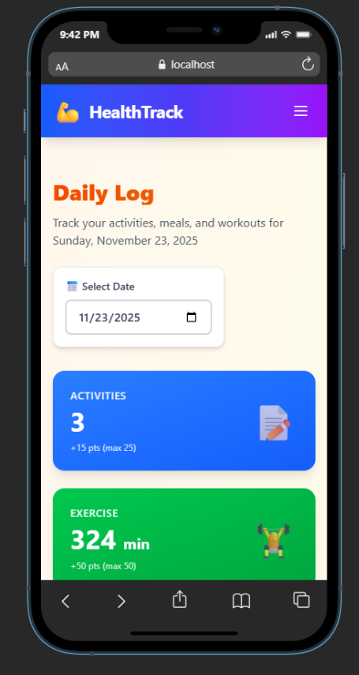

# HealthTrack - Wellness & Fitness Tracking Application


## 📋 Project Description

HealthTrack is a modern, responsive web application designed to help users track their daily wellness activities, meals, and exercises. The application provides an intuitive interface for logging daily health data and calculates a comprehensive wellness score based on user activities.

### Key Features

- **📝 Activity Logging**: Track daily activities with categories (Work, Study, Leisure, Sleep, Other) and duration
- **🍎 Meal Tracking**: Record meals with type (Breakfast, Lunch, Dinner, Snack), descriptions, and calorie counts
- **🏋️ Exercise Monitoring**: Log workouts with type, duration, and intensity levels (Low, Medium, High)
- **⭐ Wellness Score**: Automatic calculation of daily wellness score based on logged activities
- **📅 Date Navigation**: Easy switching between dates to view historical data
- **💾 Local Storage**: All data stored locally in browser for privacy and offline access
- **📱 Responsive Design**: Fully responsive interface that works on desktop, tablet, and mobile devices

### Wellness Scoring System

The wellness score is calculated out of 100 points based on:
- **Activities**: Up to 25 points (target: 5 activities)
- **Exercise**: Up to 50 points (target: 30 minutes)
- **Meals**: Up to 10 points (target: 3 meals)
- **Calorie Balance**: Up to 15 points (optimal: 1800-2500 calories)

## 🚀 Technologies Used

- **Frontend Framework**: React 19.2.0
- **Routing**: React Router DOM 7.9.6
- **Styling**: Tailwind CSS 4.1.17
- **Build Tool**: Vite 7.2.2
- **State Management**: React Hooks (useState, useEffect)
- **Data Persistence**: Browser LocalStorage API
- **Language**: JavaScript (ES6+)

## 📦 Setup Instructions

### Prerequisites

- Node.js (v18 or higher)
- npm or yarn package manager

### Installation Steps

1. **Clone the repository**
   ```bash
   git clone https://github.com/abdelrahman-assoum/web2-project1.git
   cd web2-project1
   ```

2. **Install dependencies**
   ```bash
   npm install
   ```

3. **Start the development server**
   ```bash
   npm run dev
   ```

4. **Open your browser**
   
   Navigate to `http://localhost:5173` (or the URL shown in your terminal)

### Available Scripts

- `npm run dev` - Start development server
- `npm run build` - Build for production
- `npm run preview` - Preview production build
- `npm run lint` - Run ESLint for code quality

## 📁 Project Structure

```
web2-project1/
├── public/
│   └── images/
│       └── fitness-gear.jpg
├── src/
│   ├── assets/
│   ├── components/
│   │   └── Layout/
│   │       ├── Navbar.jsx
│   │       └── Footer.jsx
│   ├── hooks/
│   │   └── useDailyData.js
│   ├── pages/
│   │   ├── Home.jsx
│   │   ├── About.jsx
│   │   ├── Features.jsx
│   │   ├── Contact.jsx
│   │   └── DailyLog.jsx
│   ├── App.jsx
│   ├── App.css
│   ├── index.css
│   └── main.jsx
├── index.html
├── package.json
├── vite.config.js
├── eslint.config.js
└── README.md
```

## 🖥️ Screenshots

### Home Page (Desktop)

*Landing page with hero section and feature overview*

### Daily Log Interface (Desktop)

*Main tracking interface with activity, meal, and exercise logging*

### Features Page (Desktop)

*Comprehensive feature showcase with all features displayed*

### Responsive Design - Mobile Views

<p float="left">
  
  
</p>

*Mobile-optimized interface: Home page (left) and Daily Log (right)*
